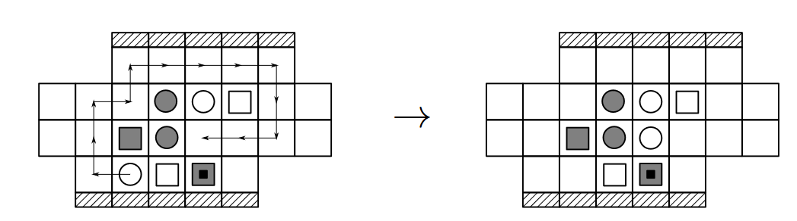
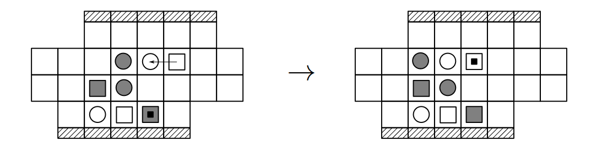
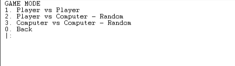
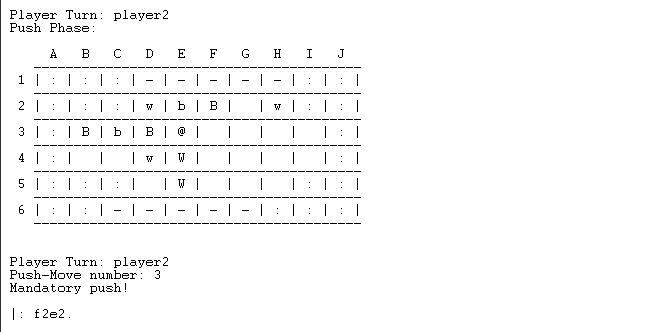

# PFL_TP1_T8_PushFight_1

## Identificação

Grupo: **(T8_PushFight_1)**

- Flávio Lobo Vaz (201509918)
- Ntsay Zacarias (202008863)

## Instalação e Execução
Após a [instalação do SICStus 4.8.0](https://sicstus.sics.se/download4.html):

1. 

**Linux/Mac**
~~~bash
$ ./usr/local/sicstus4.8.0
~~~
**Windows**
> Correr a aplicação SICStus Prolog

2.
~~~
[main].
start.
~~~

# Descrição 

O Push Fight é um jogo de tabuleiro para dois jogadores, caracterizado por um tabuleiro de design não convencional. Cada jogador possui um conjunto de 5 peças - 3 com forma quadrada e 2 redondas - que são diferenciadas pela cor, sendo um conjunto branco e outro preto

 
### Objetivo
O objectivo do jogo é empurrar pelo menos uma peça do adversário para fora do tabuleiro. Mas também pode ser ganho ao encurralar o seu adversário e força-lo à submissão.

### Regras
Cada jogador, na sua vez, tem três possíveis jogadas, das quais 2 são opcionais,
nessas pode mover qualquer peça para qualquer casa (que exista caminho para) desde que não seja a sua diagonal adjacente, e na última, o jogador deve obrigatoriamente, empurrar a uma ou à um grupo de peças, uma casa, usando uma peça quadrada.

Exemplo de uma jogada

Exemplo de um empurro

Após este empurro, é colocada uma âncora por cima da peça que efetua o mesmo, tornando esta fila de peças, *não empurrável* até que uma outra fila de peças seja empurrada. 

[Website Oficial do Jogo - pushfightgame.com](https://pushfightgame.com/)

# Lógica 

### 1. Representação interna do estado do Jogo

O estado do jogo é definido por um tabuleiro `Board` e o jogador da vez `CurrentPlayer`. O tabuleiro é uma matriz com várias linhas, onde cada linha representa uma sequência de células, e cada célula pode conter uma peça que pertence a um jogador, uma side rail `sr`, ou estar vazia, `empty`.

- `out` : Indica uma posição no limite jogável da Board. Se uma peça é empurrada para essa posição, ela é efetivamente removida do jogo, e isso determina o fim do mesmo.
- `sr` (side rail): Define as bordas do tabuleiro, servindo como uma barreira que as peças não podem atravessar nem ser empurradas.
- `w_round` e `w_square`: Representam as peças do jogador das peças brancas.
- `b_round` e `b_square`: Representam as peças do jogador das peças pretas. 
`empty` : Representa uma célula vazia.

> Um possível estado inicial do jogo
~~~
[[out,out,out,sr,sr,sr,sr,sr,out,out],
[out,out,out,w_round,b_round,b_square,empty,empty,out,out],
[out,b_round,b_square,b_round,b_square,w_square,empty,empty,empty,out],
[out,empty,empty,w_round,w_square,empty,empty,empty,empty,out],
[out,out,out,empty,w_square,w_round,empty,empty,out,out],
[out,out,sr,sr,sr,sr,sr,out,out,out]] 
~~~

>Um possível estado intermédio do jogo
~~~
[[out, out, out, sr, sr, sr, sr, sr, out, out],
[out, out, out, empty, w_round, b_square, b_round, empty, out, out],
[out, b_round, b_square, empty, b_square, w_square, w_round, empty, empty,out],
[out, empty, empty, empty, w_square, empty, empty, b_round, empty, out],
[out, out, out, w_round, empty, w_square, empty, empty, out, out],
[out, out, sr, sr, sr, sr, sr, out, out, out]]
~~~

>Um possível estado final do jogo onde uma peça tenha sido empurrada:
~~~
[[out, out, out, sr, sr, sr, sr, sr, out, out],
[out, out, out, empty, w_round, empty, b_round, empty, out, out],
[out, b_round, b_square, empty, b_square, w_square, w_round, empty, empty, out],
[out, empty, empty, empty, w_square, empty, empty, b_round, empty, out],
[out, out, out, w_round, empty, w_square, empty, empty, out, out],
[out, out, sr, sr, sr, sr, sr, out, out, out]]
~~~

Internamente os jogadores são representados como `player1` e `player2` em jogos *PvP*, `ai` e `player` em *PvC*, e `ai1` ou `ai2` em partidas *CvC*.

## 2. Visualização do estado de Jogo

O menu principal, acedido através do predicado `main_menu/0`, oferece ao jogador três opções: iniciar o jogo, consultar as regras ou sair da aplicação.

Após o início do jogo, o jogador é convidado pelo predicado `game_mode_choice/0` a selecionar o tipo de jogo que deseja jogar, sendo-lhe apresentadas as opções: `PvP` , `PvC` e `CvC`. 

Considerando que o equilíbrio entre o número de peças é influenciado pelo formato do tabuleiro, optámos por manter o tamanho do tabuleiro inalterado, não oferecendo a opção de o modificar

Prosseguimos com o jogo através de `game_loop/2`, que mantém o registo do tabuleiro e de qual jogador tem a vez, invocando `player_turn/4` para controlar o número de jogadas e processá-las, alterando assim o estado do jogo.

Segue-se a chamada de `display_board/2`, que se adapta ao tamanho da lista que está a ser percorrida e calcula o número de colunas para montar o header (com as letras que identificam as colunas) e as linhas (com os números).

Em cada jogada, informamos os jogadores sobre quem tem a vez e qual jogada foi efetuada, assegurando assim que ambos estão atualizados e envolvidos no desenvolvimento da partida.

## 3. Validação e Execução de jogadas

- **Movimentos Possíveis**

    Após a tentativa de jogada, identificamos todas as possíveis posições para as quais uma peça pode se mover (cima, baixo, esquerda, direita) a partir de sua posição atual. Isso é feito com o predicado `possible_move/4`, que também verifica se a nova posição é válida dentro do tabuleiro.

    Em seguida, através do predicado `valid_move/5`, verificamos se é possível mover a peça da posição atual para a posição de destino, que usa uma abordagem recursiva para explorar todos os caminhos possíveis sem revisitar as células já verificadas, guardadas no Visited.

- **Condições de Movimento**

Para um movimento ser considerado válido, a posição de destino deve estar vazia, e a posição de origem deve conter uma peça do jogador que está a fazer a jogada.

- **Execução do Movimento**

    Uma vez validado o movimento, procedemos para alterar o GameState.
    Limpando a origem e preenchedo o destino com a peça do jogador

## 4. Fim do Jogo 

TBD

## 5. Avaliação do Estado do Jogo

Sendo o Push Fight um jogo de estratégia, implementamos uma série de heurísticas  que nos ajudaram a entender o game state o e projetar movimentos futuros. 

- *Força de uma posição* - peças próximas ao centro são consideradas mais fortes por terem mais opções de movimento, e as peças nas bordas como vulneráveis, pois estão mais próximas de serem empurradas.
- Peças com mais opções de movimento podem proporcionar maior controle sobre o jogo.
- Verificamos se qualquer jogador está a uma jogada de perder ou ganhar o jogo, o que deveria aumentar a urgência de ações defensivas ou ofensivas.

## 6. Jogadas do Computador

- **Random AI**

Para cada peça da IA, são gerados todos os movimentos possíveis usando o predicado `generate_moves_for_piece/5` . Este predicado calcula, para uma posição específica de uma peça, todas as posições de destino válidas onde a peça poderia se mover.

Após a geração de todos os movimentos possíveis, é feita uma filtragem com o `filter_valid_moves/4`, que utiliza `is_valid_move/3` para assegurar que todos os movimentos considerados são permitidos. Só são mantidos os movimentos válidos na lista de movimentos possíveis, e desses é selecionado um de forma aleatória pelo predicado `random_move/2`.

# Conclusões
TBD
## Limitações
TBD
## Melhorias

# Bibliografia
- [Push Fight - Strategic analysis](https://www.abstractgames.org/pushfight.html)
- [Push Fight Online CvC](https://styx.verver.ch/pushfight/)
- [Website Oficial do Jogo - pushfightgame.com](https://pushfightgame.com/)
- [Computational Complexity of Generalized Push Fight](https://pushfightgame.com/index_htm_files/Push%20Fight%20MIT%20Paper.pdf)

