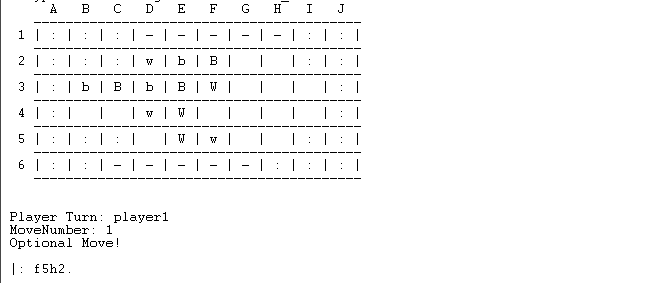

# PFL_TP1_T8_PushFight_1

## Identificação

Grupo: **(T8_PushFight_1)**

- Flávio Lobo Vaz (201509918)
- Ntsay Zacarias (202008863)

## Instalação e Execução
Após a [instalação do SICStus 4.8.0](https://sicstus.sics.se/download4.html):

1. 

**Linux/Mac**
~~~bash
$ ./usr/local/sicstus4.8.0
~~~
**Windows**
> Correr a aplicação SICStus Prolog

2.
~~~
[main].
start.
~~~

# Descrição 

O Push Fight é um jogo de tabuleiro para dois jogadores, caracterizado por um tabuleiro de design não convencional. Cada jogador possui um conjunto de 5 peças - 3 com forma quadrada e 2 redondas - que são diferenciadas pela cor, sendo um conjunto branco e outro preto

 
### Objetivo
O objectivo do jogo é empurrar pelo menos uma peça do adversário para fora do tabuleiro. Mas também pode ser ganho ao encurralar o seu adversário e força-lo à submissão.

### Regras
Cada jogador, na sua vez, tem três possíveis jogadas, das quais 2 são opcionais,
nessas pode mover qualquer peça para qualquer casa (que exista caminho para) desde que não seja a sua diagonal adjacente, e na última, o jogador deve obrigatoriamente, empurrar a uma ou à um grupo de peças, uma casa, usando uma peça quadrada.

Exemplo de uma jogada

Exemplo de um empurro

Após este empurro, é colocada uma âncora por cima da peça que efetua o mesmo, tornando esta fila de peças, *não empurrável* até que uma outra fila de peças seja empurrada. 

[Website Oficial do Jogo - pushfightgame.com](https://pushfightgame.com/)

# Lógica 

### 1. Representação interna do estado do Jogo

O estado do jogo é definido por um tabuleiro `Board` e o jogador da vez `CurrentPlayer`. O tabuleiro é uma matriz com várias linhas, onde cada linha representa uma sequência de células, e cada célula pode conter uma peça que pertence a um jogador, uma side rail `sr`, ou estar vazia, `empty`.

- `out` : Indica uma posição no limite jogável da Board. Se uma peça é empurrada para essa posição, ela é efetivamente removida do jogo, e isso determina o fim do mesmo.
- `sr` (side rail): Define as bordas do tabuleiro, servindo como uma barreira que as peças não podem atravessar nem ser empurradas.
- `w_round` e `w_square`: Representam as peças do jogador das peças brancas.
- `b_round` e `b_square`: Representam as peças do jogador das peças pretas. 
`empty` : Representa uma célula vazia.

> Um possível estado inicial do jogo
~~~
[[out,out,out,sr,sr,sr,sr,sr,out,out],
[out,out,out,w_round,b_round,b_square,empty,empty,out,out],
[out,b_round,b_square,b_round,b_square,w_square,empty,empty,empty,out],
[out,empty,empty,w_round,w_square,empty,empty,empty,empty,out],
[out,out,out,empty,w_square,w_round,empty,empty,out,out],
[out,out,sr,sr,sr,sr,sr,out,out,out]] 
~~~

>Um possível estado intermédio do jogo
~~~
[[out, out, out, sr, sr, sr, sr, sr, out, out],
[out, out, out, empty, w_round, b_square, b_round, empty, out, out],
[out, b_round, b_square, empty, b_square, w_square, w_round, empty, empty,out],
[out, empty, empty, empty, w_square, empty, empty, b_round, empty, out],
[out, out, out, w_round, empty, w_square, empty, empty, out, out],
[out, out, sr, sr, sr, sr, sr, out, out, out]]
~~~

>Um possível estado final do jogo onde uma peça tenha sido empurrada:
~~~
[[out, out, out, sr, sr, sr, sr, sr, out, out],
[out, out, out, empty, w_round, empty, b_round, empty, out, out],
[out, b_round, b_square, empty, b_square, w_square, w_round, empty, empty, out],
[out, empty, empty, empty, w_square, empty, empty, b_round, empty, out],
[out, out, out, w_round, empty, w_square, empty, empty, out, out],
[out, out, sr, sr, sr, sr, sr, out, out, out]]
~~~

Internamente, os jogadores são representados da seguinte maneira: em jogos Jogador vs. Jogador (PvP), como player1 e player2; em jogos Jogador vs. Computador (PvC), como player1 e ai2_rand ou ai2_advanc dependendo da complexidade da inteligência artificial; e em partidas Computador vs. Computador (CvC), como ai1_advanc e ai2_advanc para estratégias avançadas da IA.

## 2. Visualização do estado de Jogo

O menu principal, acedido através do predicado `main_menu/0`, oferece ao jogador três opções: iniciar o jogo, consultar as regras ou sair da aplicação.

Após o início do jogo, o jogador é convidado pelo predicado `game_mode_choice/0` a selecionar o tipo de jogo que deseja jogar, sendo-lhe apresentadas as opções: `PvP` , `PvC` e `CvC`. 
Tendo duas IAs , criamos várias combinações de modos de jogo. Algumas opções incluem (PvP), Jogador vs. Computador com AI de estratégia aleatória ou avançada (PvC), e Computador vs. Computador, onde ambos utilizam estratégias avançadas ou uma mistura com aleatórias (CvC).

Considerando que o equilíbrio entre o número de peças é influenciado pelo formato do tabuleiro, optámos por manter o tamanho do tabuleiro inalterado, não oferecendo a opção de o modificar

Prosseguimos com o jogo através de `game_loop/2` e `game_loop/3`, que mantêmm o registo do tabuleiro e de qual jogador tem a vez, invocando `player_turn/4` ou `ai_move_turn/4` para controlar o número de jogadas do jogador e da IA e processá-las, alterando assim o estado do jogo.

Segue-se a chamada de `display_board/2`, que se adapta ao tamanho da lista que está a ser percorrida e calcula o número de colunas para montar o header (com as letras que identificam as colunas) e as linhas (com os números).

Em cada jogada, informamos os jogadores sobre quem tem a vez e qual jogada foi efetuada, assegurando assim que ambos estão atualizados e envolvidos no desenvolvimento da partida.

## 3. Validação e Execução de jogadas

- **Movimentos Possíveis**

    Após a tentativa de jogada, identificamos todas as possíveis posições para as quais uma peça pode se mover (cima, baixo, esquerda, direita) a partir de sua posição atual. Isso é feito com o predicado `possible_move/4`, que também verifica se a nova posição é válida dentro do tabuleiro.

    Em seguida, através do predicado `valid_move/5`, verificamos se é possível mover a peça da posição atual para a posição de destino, que usa uma abordagem recursiva para explorar todos os caminhos possíveis sem revisitar as células já verificadas, guardadas no Visited.

- **Condições de Movimento**

Para um movimento ser considerado válido, a posição de destino deve estar vazia, e a posição de origem deve conter uma peça do jogador que está a fazer a jogada.

- **Execução do Movimento**

    Uma vez validado o movimento, procedemos para alterar o GameState.
    Limpando a origem e preenchedo o destino com a peça do jogador

## 4. Fim do Jogo 

São avaliadas três condições para verificar o fim de um jogo: 

- Perda por Falta de Peças: Um jogador perde se não tiver mais peças no tabuleiro. Isso é verificado pelo predicado player_lost_game, que calcula o número total de peças de um jogador e compara com o mínimo necessário para continuar o jogo.

- Empate ou Perda por Impossibilidade de empurrar: Se um jogador não puder realizar nenhum empurrão, e esta condição também se aplicar ao oponente, o jogo resulta em empate. Isso é verificado pelo predicado players_cant_push_draw/2. Se apenas o jogador atual não puder empurrar, ele perde a partida, verificado por player_cant_push/1.

- Vitória por Empurrar Peça do Oponente para Fora: Se um jogador consegue empurrar uma peça do oponente para fora do tabuleiro, esse jogador é declarado vencedor.

## 5. Avaliação do Estado do Jogo

A estratégia no jogo é implementada pelo uso de heurísticas que analisam o estado do jogo para compreender e antecipar jogadas futuras. 

Reconhecemos o valor de uma posição pela proximidade das peças ao centro do tabuleiro, atribuindo-lhes maior valor quanto mais opções de movimentos disponíveis. Em contrapartida, peças posicionadas nas bordas são vistas como vulneráveis, correndo um risco maior de serem empurradas para fora. 

Esta avaliação do valor posicional e a capacidade de movimento de cada peça influencia diretamente as ações defensivas e ofensivas das IAs.

- Utilizamos o predicado evaluate_mobility/3 para medir a mobilidade geral, considerando que peças centrais têm mais opções e, portanto, uma posição mais forte.
- A capacidade de push é avaliada por evaluate_push_mobility/3, que indica o potencial de um jogador para realizar jogadas ofensivas.
- O evaluate_game_state_list/3 ordena possíveis game states para identificar oportunidades imediatas de vitória ou derrota.
- A função value/3 usa essas avaliações, permitindo decisões baseadas na qualidade e não apenas na quantidade de jogadas, focando na minimização de riscos e maximização de oportunidades.

## 6. Jogadas do Computador

- **IA Aleatória**

As jogadas desta IA iniciam com o find_move_game_states/3 que gera todos os movimentos válidos para as suas peças, excluindo aqueles que resultariam na incapacidade de empurrar. A escolha é aleatória, mas restringida a movimentos que mantêm o jogo viável para ela.

Após o movimento, a IA usa find_push_game_states/3 para identificar pushes válidos, evitando aqueles que a levariam a perder. O número de movimentos realizados é contabilizado em MoveCount e a seleção aleatória é feita random_member/2, garantindo que a IA jogue de forma imprevisível mas sem prejudicar-se.

- **IA Avançada**

Com o predicado ai_move_game_state/3, ela explora os possíveis movimentos para identificar aqueles que maximizam a posição estratégica, avaliando as jogadas com evaluate_game_state_list/3. Ao identificar múltiplos estados de jogo com o mesmo valor ótimo, ela faz uma seleção aleatória usando random_member/2 para escolher entre eles, evitando padrões previsíveis.

O processo de tomada de decisão envolve a contagem de movimentos efetuados com count_moves/4, permitindo à IA decidir entre realizar zero, um ou dois movimentos antes do empurrão. O predicado ai_push_move/3 é utilizado para escolher o melhor empurrão, também baseando-se na avaliação estratégica dos estados de jogo pós-empurrão, assegurando que a IA atue de maneira sofisticada e com consideração tática, mantendo a competitividade do jogo.

# Conclusões

## Limitações
- As IA não funcionam correctamente com as boards geradas pelo utilizador.

## Melhorias

- Gostariamos de desenvolver heurísticas mais complexas que levem em conta não apenas a mobilidade e a capacidade do push, mas também a formação de padrões e potenciais armadilhas para o oponente.

# Bibliografia
- [Push Fight - Strategic analysis](https://www.abstractgames.org/pushfight.html)
- [Push Fight Online CvC](https://styx.verver.ch/pushfight/)
- [Website Oficial do Jogo - pushfightgame.com](https://pushfightgame.com/)
- [Computational Complexity of Generalized Push Fight](https://pushfightgame.com/index_htm_files/Push%20Fight%20MIT%20Paper.pdf)

