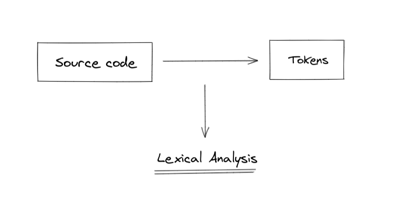

# INTRODUÇÃO

> Introducao do projecto

> Explicação da divisão entre módulos e o que cada um faz, high level explanation nothing much

> Grafico com a interação entre os mesmos

## IMPLEMENTAÇÃO - PARTE 1

> objetivos

#### Módulo `MachineStructures.hs`

O módulo `MachineStructures` define os elementos fundamentais e os tipos de dados utilizados durante o funcionamento do Interpreter.

`Inst`: Este é um tipo de dados algébrico que representa as instruções da máquina, como operações aritméticas (Add, Sub, Mult), operações lógicas (And, Neg), fluxo de controlo (Branch, Loop), manipulação da Stack e State (Push, Fetch, Store) entre outras. Cada construtor no Inst encapsula uma operação ou comando distinto que a máquina pode executar.

~~~hs
data Inst = Push !Integer | Add | Mult | Sub | Tru | Fals | Equ ...
~~~

~~~hs
type Code = [Inst]
~~~
> O `Code` é uma lista de `Inst`

`Stack` : Uma lista de `StackValue`, onde o valor pode ser um número inteiro `(IntVal)` ou um booleano `(TT, FF)` . É utilizada para avaliar expressões e armazenar temporariamente valores durante a execução.

~~~hs
type Stack = [StackValue]
~~~
> A `Stack` é uma lista de `StackValues`

`State`: Definido como  `(Map.Map String StackValue)`, representa o armazenamento ou a memória da máquina. É essencialmente um map dos nomes das variáveis para seus valores, permitindo que a máquina armazene e recupere dados.

~~~
    STATE   [x=30;y=10]
~~~

#### 2. Módulo `Assembler.hs`

O módulo Assembler é onde se encontra a funcionalidade central do interpretador. Processa uma lista de instruções (Code) juntamente com uma Stack e o State, executando as operações fornecidas. 

Lógica de execução 

`exec`: Esta função é o coração do interpretador. Ela recebe uma tupla de Código, Pilha e Estado e aplica a primeira instrução da lista de Código à Pilha e ao Estado atuais. A função trata cada tipo de instrução de forma diferente, actualizando a pilha e o estado conforme necessário.

erros: Um tratamento de erros robusto é implementado para detetar erros de tempo de execução, como underflows na stack ou operações inválidas . Isto assegura que o intérprete se comporta de forma previsível e segura em situações erróneas.

Instruções de fluxo de controlo: A ramificação e o ciclo são fundamentais para a execução condicional e as construções de ciclo. Alteram o fluxo de execução do programa com base nos valores da pilha ou transformam a lista de códigos para implementar a lógica de ciclo.

## Resultado 

    Instruções e manipulação da pilha: Instruções como Push, Add, Sub e Mult manipulam diretamente a pilha, quer adicionando novos valores, quer executando operações sobre os valores existentes na pilha.

    Interação de estados: Instruções como Fetch e Store interagem com o estado para recuperar ou atualizar valores de variáveis, fazendo a ponte entre as operações efémeras da pilha e as alterações mais persistentes do estado.

    Gestão do fluxo de controlo: Branch e Loop usam o estado atual da pilha (particularmente os valores do topo) para decidir o curso futuro do programa, tomando decisões dinâmicas baseadas em dados de tempo de execução.

Cenários de exemplo

    Computação aritmética: Para uma sequência de código como [Push 1, Push 2, Add], o interpretador coloca 1 e 2 na pilha e, em seguida, adiciona esses dois valores, atualizando a pilha com o resultado (3).

    Lógica condicional: Numa instrução Branch, a decisão sobre o caminho a seguir baseia-se no valor booleano no topo da pilha, demonstrando como o estado da pilha influencia o fluxo de controlo do programa.

    Tratamento de erros: Se uma instrução Adicionar for encontrada com menos de dois itens na pilha, o interpretador lança um erro em tempo de execução, mostrando a importância do tratamento de erros na robustez do sistema.

## IMPLEMENTAÇÃO - PARTE 2

